# PGDatePicker
日期选择器，支持年、年月、年月日、年月日时、年月日时分、年月日时分秒、月日、月日时、月日时分、月日时分秒、时、时分、时分秒、分秒、月日周 时分等，内置了3种样式。

> 由于使用UIPickerView的话，列表会有个弧度，所以这里用了[PGPickerView](https://github.com/xiaozhuxiong121/PGPickerView)  


[](https://cocoapods.org/pods/PGDatePicker)
 
 
 [](http://www.jianshu.com/u/3740632b2002)   


#### 直接看如何使用:[Wiki](https://github.com/xiaozhuxiong121/PGDatePicker/wiki)

# 样式1

# 样式2

# 样式3
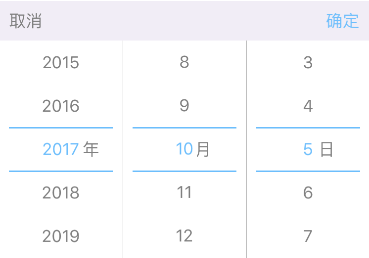

> 只显示中间的文字，设置```isHiddenMiddleText```为```false```即可，默认是```true```

# 年份
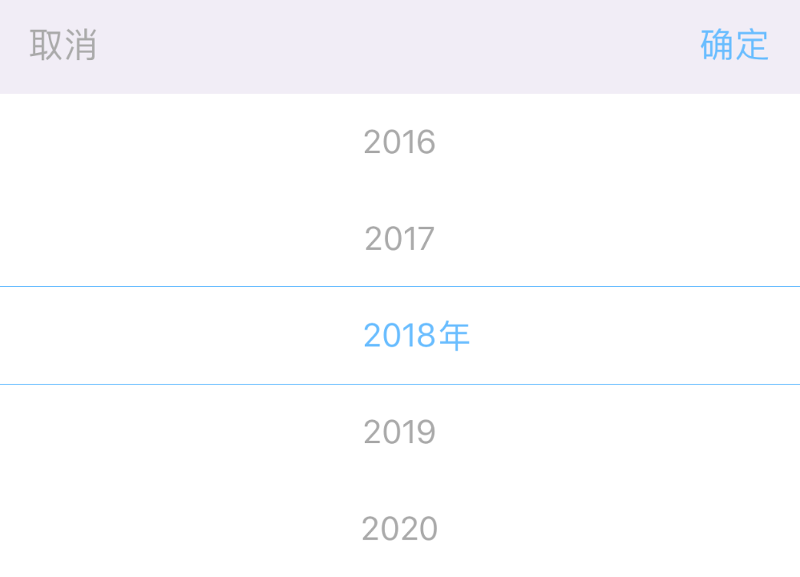

# 年月
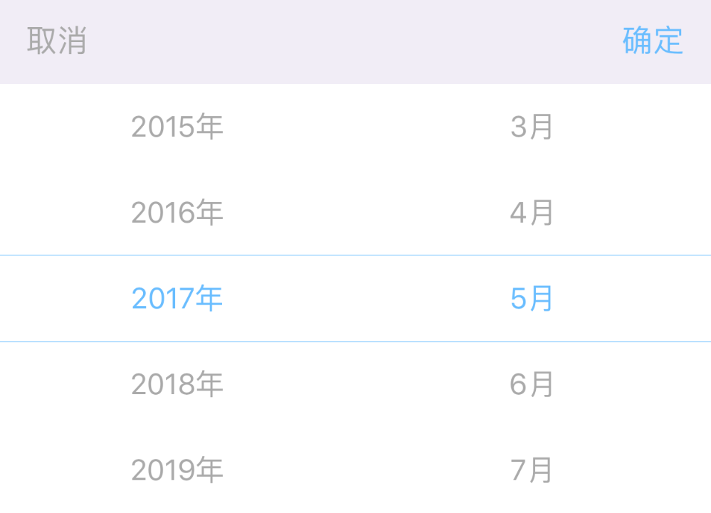

# 年月日
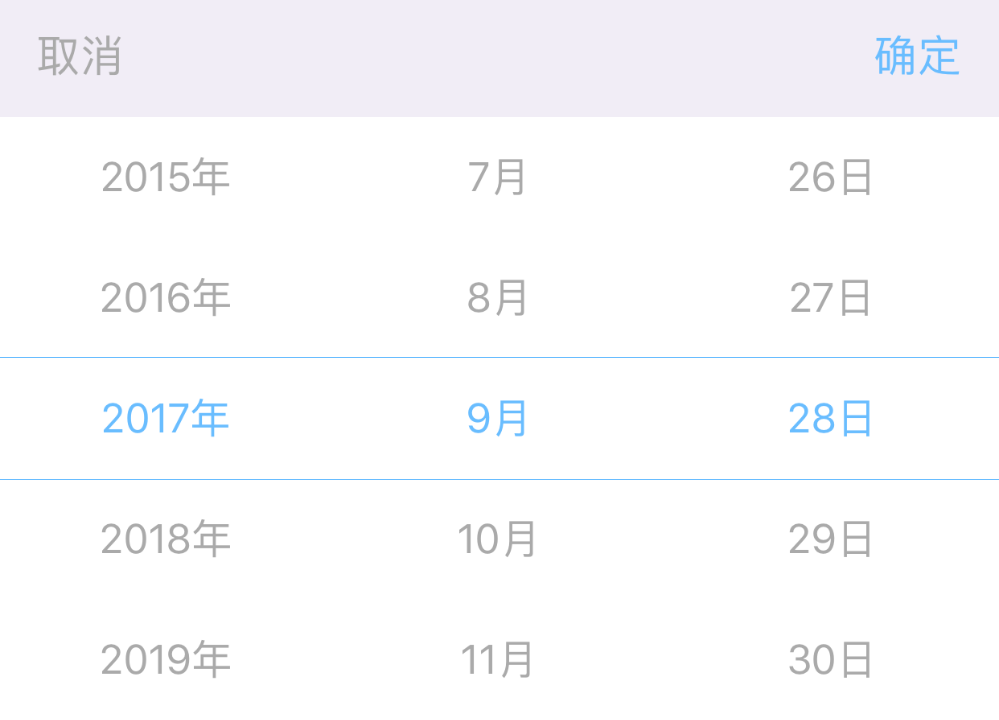

# 年月日时
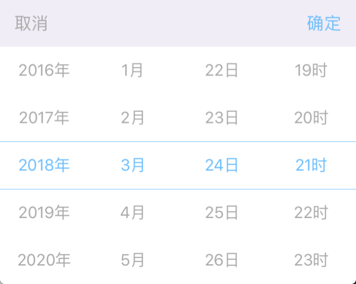

# 年月日时分
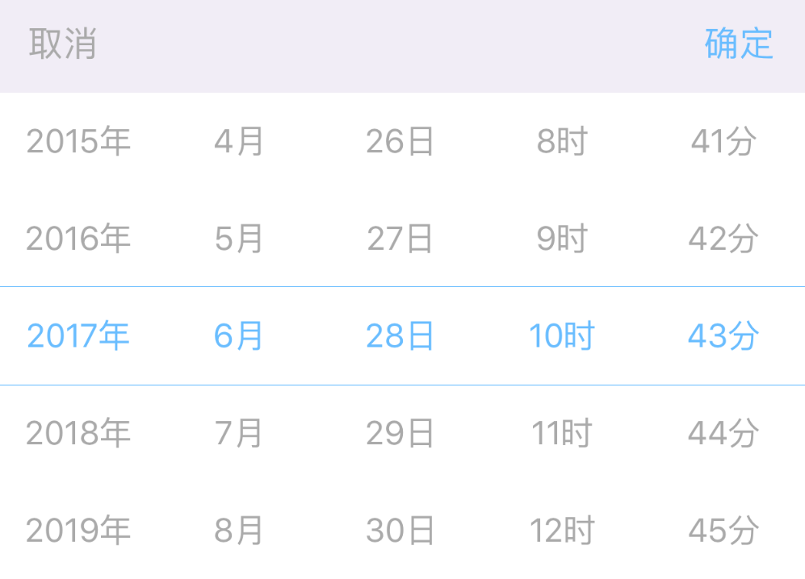

# 年月日时分秒

# 月日
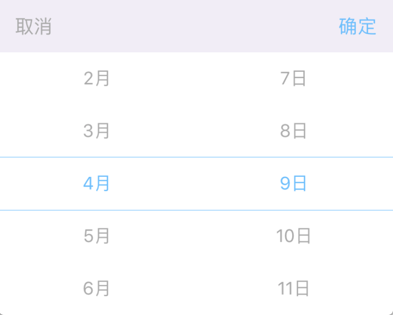
# 月日时
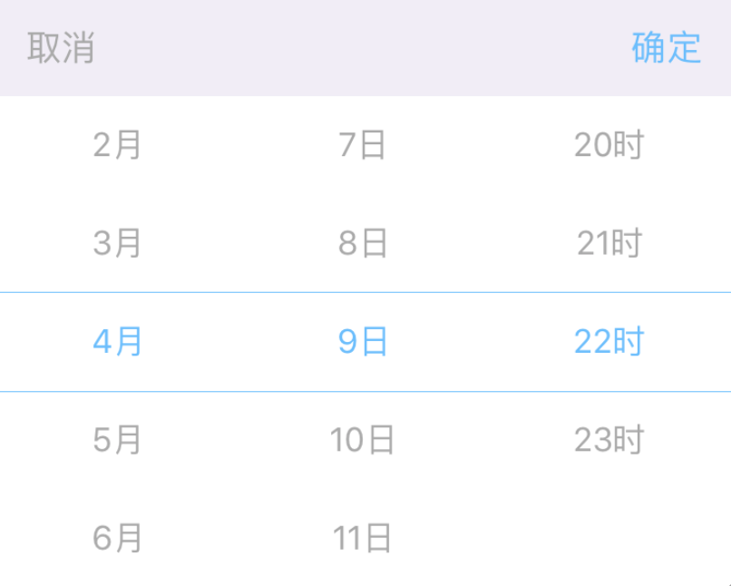
# 月日时分
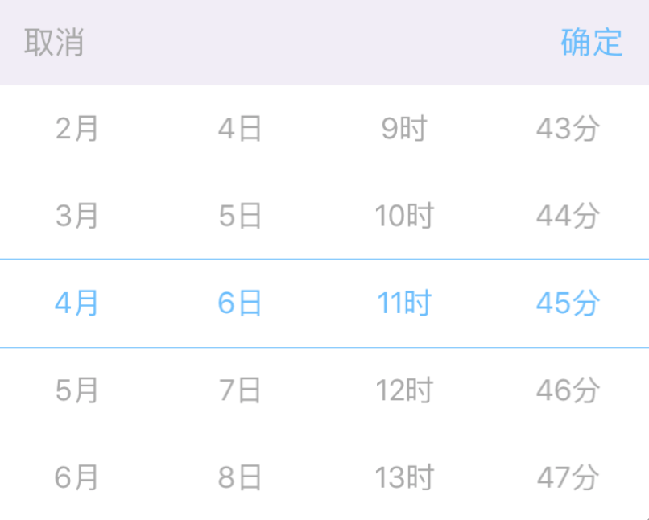
# 月日时分秒
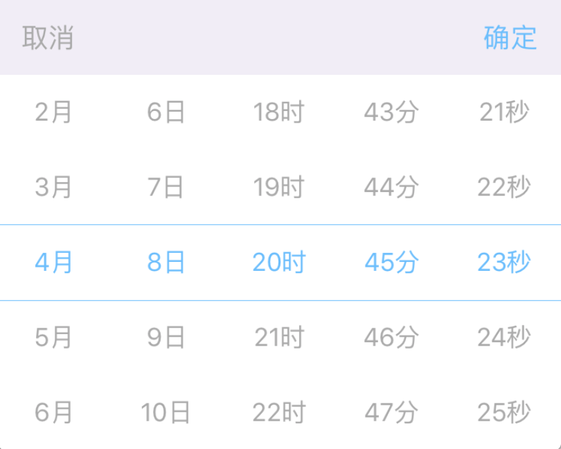


# 时分
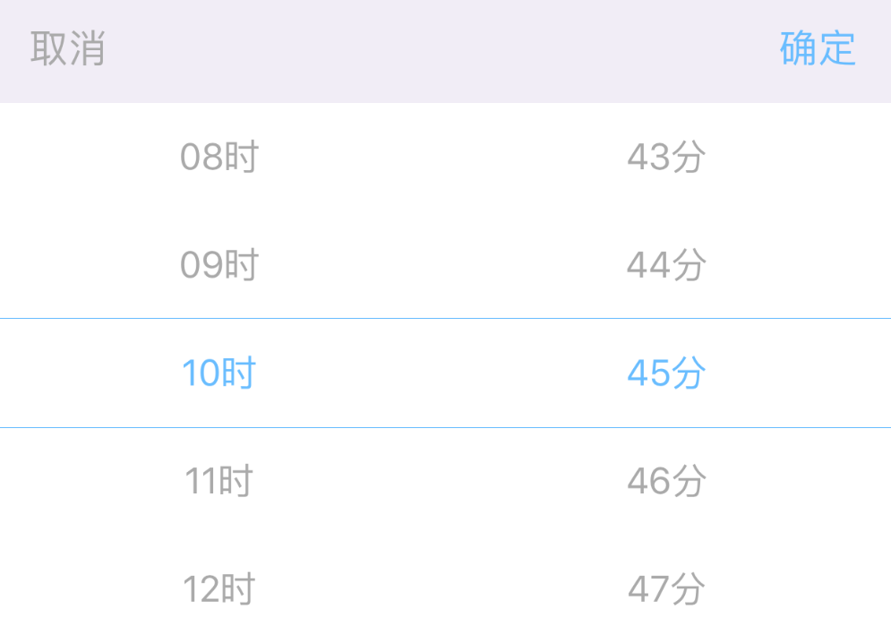

# 时分秒
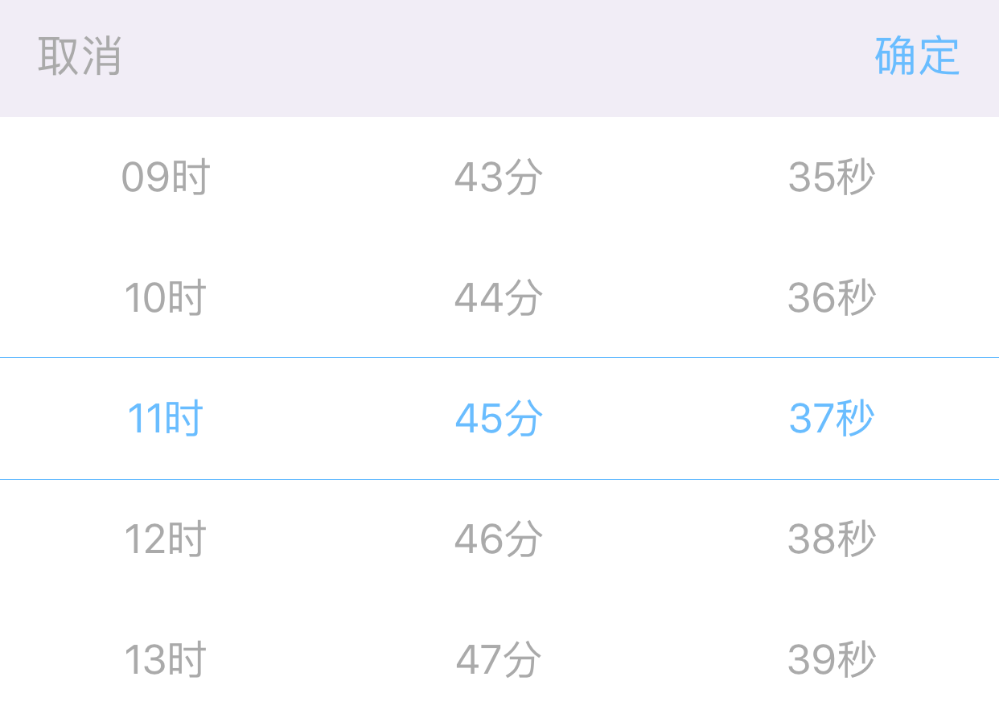
# 分秒
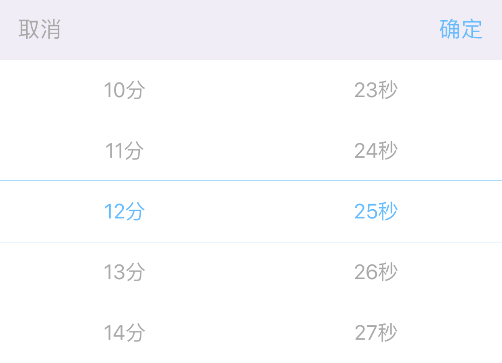

# 月日周 时分
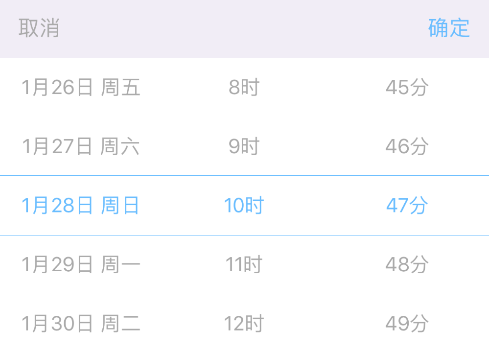
# 其他样式
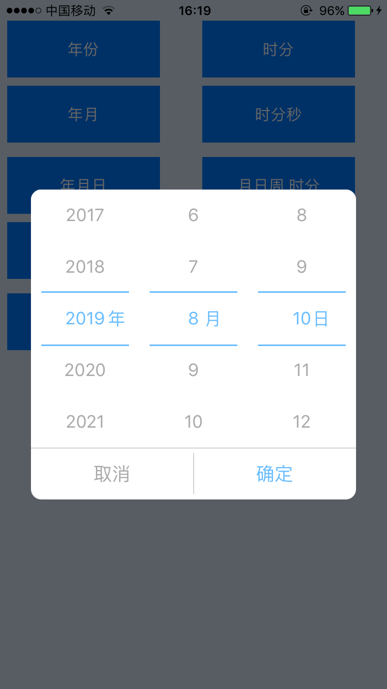
# 其他样式
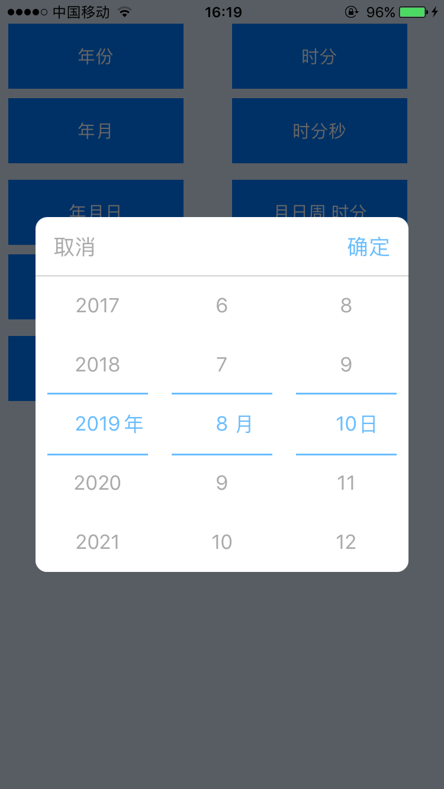

# 设置自己的样式
如果内置的样式都满足不了你的需要，想自己设置样式，也是完全支持的，可以将`PGDatePicker`创建出来添加到你的`View`上。

```
PGDatePicker *datePicker = [[PGDatePicker alloc]init];
[self.view addSubview:datePicker];
```

`PGDatePickManager`类就是一个典型的例子，你可以下载源码查看`PGDatePickManager`的简单实现，或许对你自己封装会有所帮助。

# Swift使用
[查看使用文档](Swift.md) 

# CocoaPods安装

```
pod 'PGDatePicker'
```

> **在`1.5.1`版本中对iPhone X进行了适配** 

# 使用
引入头文件

```
#import <PGDatePick/PGDatePickManager.h>
```
```
PGDatePickManager *datePickManager = [[PGDatePickManager alloc]init];
PGDatePicker *datePicker = datePickManager.datePicker;
datePicker.delegate = self;
[self presentViewController:datePickManager animated:false completion:nil];
```
#### Delegate
```
#pragma PGDatePickerDelegate
- (void)datePicker:(PGDatePicker *)datePicker didSelectDate:(NSDateComponents *)dateComponents {
NSLog(@"dateComponents = %@", dateComponents);
}
```
#### Block
```
datePicker.selectedDate = ^(NSDateComponents *dateComponents) {
    NSLog(@"dateComponents = %@", dateComponents);
};
```
> 如果不设置```minimumDate```和```maximumDate```默认是无穷小和无穷大 

> 语言跟着手机系统语言走，默认有英文，中文，繁体中文，如果是模拟器的话，将模拟器的系统语言改成中文即显示中文

设置弧度(目前还是不太好，待优化)
```
datePicker.isHiddenWheels = false;
```

设置循环滚动
```
datePicker.isCycleScroll = true;
```

# 设置样式
```
PGDatePickManager *datePickManager = [[PGDatePickManager alloc]init];
PGDatePicker *datePicker = datePickManager.datePicker;
datePicker.delegate = self;
datePicker.datePickerMode = PGDatePickerModeDate;
[self presentViewController:datePickManager animated:false completion:nil];

datePickManager.titleLabel.text = @"PGDatePicker";
//设置半透明的背景颜色
datePickManager.isShadeBackgroud = true;
//设置头部的背景颜色
datePickManager.headerViewBackgroundColor = [UIColor orangeColor];
//设置线条的颜色
datePicker.lineBackgroundColor = [UIColor redColor];
//设置选中行的字体颜色
datePicker.textColorOfSelectedRow = [UIColor redColor];
//设置未选中行的字体颜色
datePicker.textColorOfOtherRow = [UIColor blackColor];
//设置取消按钮的字体颜色
datePickManager.cancelButtonTextColor = [UIColor blackColor];
//设置取消按钮的字
datePickManager.cancelButtonText = @"Cancel";
//设置取消按钮的字体大小
datePickManager.cancelButtonFont = [UIFont boldSystemFontOfSize:17];

//设置确定按钮的字体颜色
datePickManager.confirmButtonTextColor = [UIColor redColor];
//设置确定按钮的字
datePickManager.confirmButtonText = @"Sure";
//设置确定按钮的字体大小
datePickManager.confirmButtonFont = [UIFont boldSystemFontOfSize:17];

```

非常感谢[xyhuangjia](https://github.com/xyhuangjia)添加隐藏字的功能   
```
//首先将isHiddenMiddleText设置为false
datePicker.isHiddenMiddleText = false;

//然后设置showUnit
datePicker.showUnit = PGShowUnitTypeNone;

typedef NS_ENUM(NSUInteger, PGShowUnitType) {
    PGShowUnitTypeAll,      //显示全部的字
    PGShowUnitTypeCenter,   //只显示中间的字
    PGShowUnitTypeNone,     //什么字都不显示
};
````
非常感谢[sujiewen](https://github.com/sujiewen)添加的如下功能   
1、只显示时的功能   
2、对时分间隔自定义支持
```
//在时分的时候，只显示时
@property (nonatomic) BOOL isOnlyHourFlag;

//分间隔 默认时1
@property (nonatomic) NSInteger minuteInterval;

//秒间隔 默认时1
@property (nonatomic) NSInteger secondInterval;
```

非常感谢[Graphicooooone](https://github.com/Graphicooooone)添加的自定义收起动画接口的功能
```
/**
 custom dismiss controller animation, return the total duration of the custom animation, default is nil
 */
@property (nonatomic, copy) NSTimeInterval(^customDismissAnimation)(UIView* dismissView, UIView* contentView ); 
```

# 最新版本
[]()

# 想说的话
大家有好的idea欢迎随时提交PR，共同维护。   
# 许可证

PGDatePicker 使用 MIT 许可证，详情见 [LICENSE](LICENSE) 文件。

