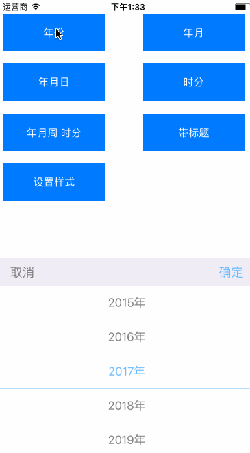

# PGDatePicker
日期选择器，支持年、年月、年月日、时分、年月周 时分等


# Installation with CocoaPods

```
pod 'PGDatePicker'
```

# Usage
```
PGDatePicker *datePicker = [[PGDatePicker alloc]init];
datePicker.delegate = self;
[datePicker show];
datePicker.datePickerMode = PGDatePickerModeYear;
 
#pragma PGDatePickerDelegate
- (void)datePicker:(PGDatePicker *)datePicker didSelectDate:(NSDateComponents *)dateComponents {
    NSLog(@"dateComponents = %@", dateComponents);
}
```


# LICENSE

PGDatePicker is released under an MIT license. See [LICENSE](LICENSE) for more information.